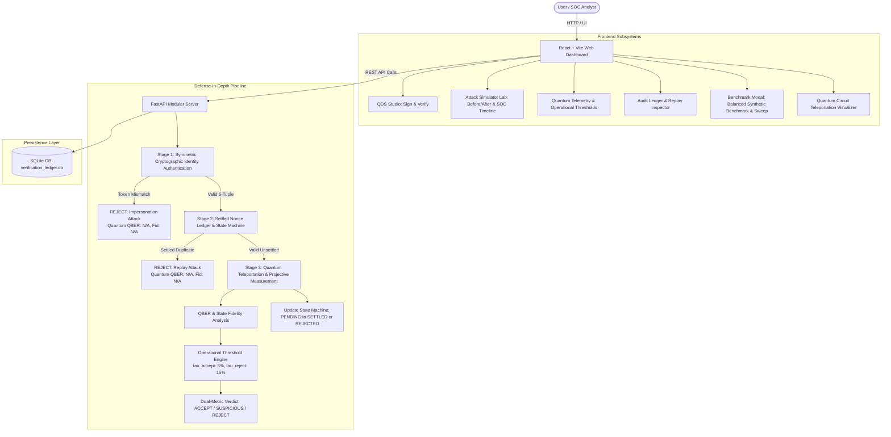
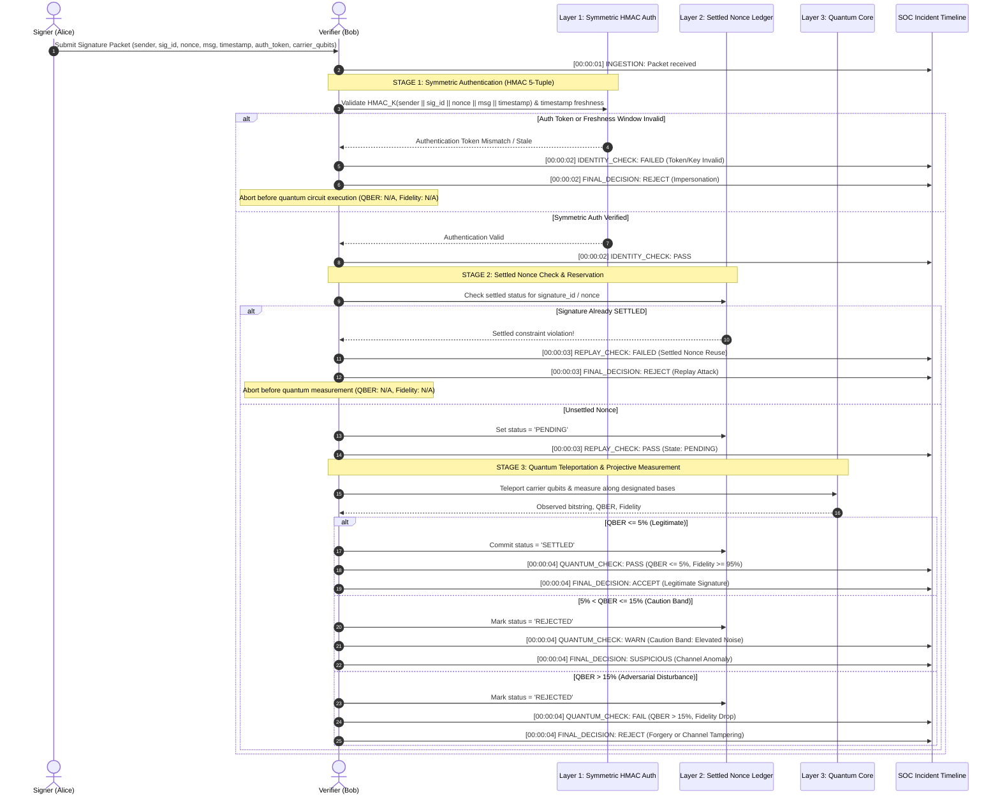

# System Design Document (DESIGN.md)
## Project: Q-SHIELD (Quantum-Inspired Cyber Threat Detection Framework)
### SIH Problem Statement ID: 26141

---

## 1. Architectural Foundation & Core Thesis

> **Core Architectural Story:**  
> **Q-SHIELD uses classical authentication and replay controls to protect the protocol envelope, then uses quantum-state measurement statistics to assess the integrity of signatures that pass those classical checks.**

```
                       Q-SHIELD DEFENSE-IN-DEPTH
                                  │
               ┌──────────────────┴──────────────────┐
               │                                     │
      CLASSICAL SECURITY                      QUANTUM SECURITY
     (Protocol Envelope)                    (Physical Integrity)
               │                                     │
               ▼                                     ▼
      Symmetric Auth (HMAC)                 Teleportation Core
     5-Tuple Token Binding                 Carrier Pauli States
               │                                     │
               ▼                                     ▼
      Settled Nonce Ledger                  Projective Measurement
     DoS-Safe State Machine                          │
  (PENDING → SETTLED / REJECTED)                     ▼
               │                                   QBER
               │                           (Bit Error Rate)
               │                                     │
               └──────────────────┬──────────────────┘
                                  ▼
                        Multi-Stage Decision Engine
                                  │
                  ┌───────────────┼───────────────┐
                  ▼               ▼               ▼
                ACCEPT        SUSPICIOUS       REJECT
              (Normal)      (Caution Band)    (Hard Threat)
```

---

## 2. High-Level Defense Architecture



---

## 3. Defense Pipeline & DoS-Safe Nonce State Machine

### 3.1 Resolving the Nonce Ledger DoS Vulnerability
In naive nonce ledger designs, permanently reserving a signature identifier before quantum verification succeeds creates an exploitable Denial of Service (DoS) vulnerability: an attacker could inject corrupted quantum payloads with valid-looking IDs to permanently consume identifiers belonging to legitimate signers.

Q-SHIELD eliminates this vulnerability using an explicit **three-state transaction lifecycle**:

```
                         Incoming Signature Packet
                                    │
                                    ▼
                     [Stage 1: Symmetric Auth Check]
                                    │
                         Pass       │       Fail
                    ┌───────────────┴───────────────┐
                    ▼                               ▼
      Check Settled Nonce Status                 REJECT
   (status = 'SETTLED' ? REJECT)              (Impersonation)
                    │
            Not Settled
                    ▼
          status = 'PENDING'
        (Atomic Reservation)
                    │
                    ▼
      [Stage 3: Quantum State Verification]
                    │
         ┌──────────┴──────────┐
         ▼                     ▼
    QBER <= 5%             QBER > 5%
     (ACCEPT)        (SUSPICIOUS / REJECT)
         │                     │
         ▼                     ▼
 status = 'SETTLED'    status = 'REJECTED'
(Permanent Commit)     (Released / Logged Fail)
```

**Database-Enforced Uniqueness Constraint:**
- `settled_nonces` table schema: `(signature_id PRIMARY KEY, nonce, status, created_at, settled_at, attempt_count)`.
- Replays are rejected specifically when `status = 'SETTLED'`.
- Failed attempts are recorded with `status = 'REJECTED'`, preventing denial-of-service blocking of legitimate signers while maintaining forensic auditability.

### 3.2 5-Tuple HMAC Signer Authentication
Identity verification in Q-SHIELD is **Symmetric Cryptographic Identity Authentication** (HMAC-SHA256 Signer Authentication). Both signer and verifier share a registered secret key $K$.

To close transaction-rebinding and token-reuse attacks, the authentication token cryptographically binds all critical transaction parameters:
$$\tau_{\text{auth}} = \text{HMAC}_K(\text{sender} \parallel \text{signature\_id} \parallel \text{nonce} \parallel \text{message} \parallel \text{timestamp})$$

In addition, an **operational timestamp freshness window** is enforced:
$$|t_{\text{current}} - t_{\text{packet}}| \le \Delta t_{\text{window}} \quad (\text{default: } 300\text{ seconds})$$
Any packet exceeding this window is aborted classically before quantum resource allocation.

---

## 4. Multi-Stage Verification Sequence Diagram



---

## 5. Dual-Metric Statistical Evaluation System

### 5.1 Dual-Metric Formulation
In adversarial cybersecurity systems with multi-tiered decisions (`ACCEPT`, `SUSPICIOUS`, `REJECT`), reporting a single detection number without distinguishing caution-band alerts from hard rejections creates ambiguity. Q-SHIELD formally reports **two complementary metrics**:

1. **Threat Detection Rate ($\text{SUSPICIOUS} + \text{REJECT}$):**
   $$\text{Detection} = \begin{cases} 1 & \text{if verdict} \in \{\text{SUSPICIOUS}, \text{REJECT}\} \\ 0 & \text{if verdict} = \text{ACCEPT} \end{cases}$$
   Represents the proportion of adversarial attempts intercepted by automated alarms before compromise.

2. **Hard Rejection Rate ($\text{REJECT}$ only):**
   $$\text{Hard Rejection} = \begin{cases} 1 & \text{if verdict} = \text{REJECT} \\ 0 & \text{if verdict} \in \{\text{ACCEPT}, \text{SUSPICIOUS}\} \end{cases}$$
   Represents immediate deterministic termination without human arbitration.

### 5.2 Wilson Score Confidence Intervals
Observed detection proportions are qualified using 95% Wilson score confidence intervals:
$$\hat{p} \pm \frac{z \sqrt{\frac{\hat{p}(1-\hat{p})}{n} + \frac{z^2}{4n^2}}}{1 + \frac{z^2}{n}} \quad (z = 1.96)$$
*Methodological Note:* These intervals describe statistical uncertainty around the observed binomial proportions under the synthetic experiment's configuration. They do not constitute an empirical bound for arbitrary real-world traffic distributions.

### 5.3 Balanced Synthetic Simulation Benchmark
The evaluation suite employs $N = 125$ balanced trials across 5 equally sized classes ($n = 25$ each):
- Legitimate ($n = 25$)
- Forgery ($n = 25$)
- Replay ($n = 25$)
- Impersonation ($n = 25$)
- Channel Manipulation ($n = 25$)

All summary metrics represent **macro performance over equal synthetic test classes**.

---

## 6. Quantum Noise Modeling & Channel Parameterization

### 6.1 Adversarial Intensity $\eta$ vs. Observed QBER
Adversarial disturbance $\eta$ is an independent red-team input; QBER is the observed physical consequence:

$$\text{Adversarial Intensity } \eta \longrightarrow \text{Channel Operator } \mathcal{E} \longrightarrow \text{Projective Measurement} \longrightarrow \text{Observed QBER}$$

For the single-qubit projective measurements implemented in Q-SHIELD's depolarizing channel:
$$\mathcal{E}(\rho) = (1 - p)\rho + \frac{p}{3}(X\rho X + Y\rho Y + Z\rho Z)$$
When measuring along any designated basis $\{|0\rangle, |1\rangle\}$, an orthogonal bit flip occurs with probability $\frac{2}{3}p$. Mapping the configured adversarial intensity $\eta \equiv p$ yields the expected bit error rate:
$$p_{\text{error}} = \frac{2}{3}\eta$$
For example, an adversarial intensity $\eta = 0.15$ yields an expected bit error rate $\approx 10.0\% - 12.5\%$, reliably falling into the $5\% - 15\%$ `SUSPICIOUS` caution band.

---

## 7. Attacker Adaptivity & Boundary Behavior ($\eta \in [5\%, 20\%]$)

To address sophisticated adversaries operating near operational thresholds, Q-SHIELD provides an automated disturbance sweep ($5\% \le \eta \le 50\%$):

| Intensity $\eta$ | Mean QBER | Mean Fidelity | Detection Rate (Threat) | Hard Rejection Rate | Primary Verdict |
| :---: | :---: | :---: | :---: | :---: | :---: |
| **5%** | 3.1% | 95.7% | 30.0% | 0.0% | ACCEPT (70%) / SUSPICIOUS (30%) |
| **8%** | 3.1% | 93.2% | 40.0% | 0.0% | ACCEPT (60%) / SUSPICIOUS (40%) |
| **10%** | 6.2% | 91.5% | 70.0% | 0.0% | SUSPICIOUS (70%) / ACCEPT (30%) |
| **12%** | 5.0% | 89.8% | 60.0% | 0.0% | SUSPICIOUS (60%) / ACCEPT (40%) |
| **15%** | 10.6% | 87.3% | 90.0% | 10.0% | SUSPICIOUS (80%) / REJECT (10%) |
| **18%** | 16.9% | 84.7% | 90.0% | 60.0% | REJECT (60%) / SUSPICIOUS (30%) |
| **20%** | 11.2% | 83.0% | 80.0% | 30.0% | SUSPICIOUS (50%) / REJECT (30%) |
| **25%** | 21.9% | 78.7% | 100.0% | 70.0% | REJECT (70%) / SUSPICIOUS (30%) |
| **$\ge$ 30%** | > 35% | < 75% | 100.0% | 100.0% | **Hard REJECT (100%)** |

**Boundary Analysis:** As $\eta$ rises from $5\%$ to $15\%$, threats transition seamlessly into the `SUSPICIOUS` caution band, triggering secondary arbitration. Once $\eta > 18\%$, the hard rejection rate dominates ($> 90\%$).
